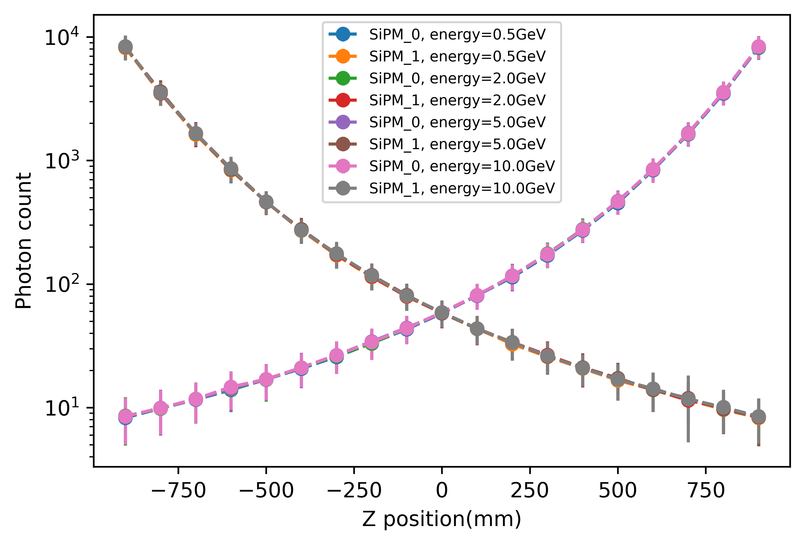

# MuonVeto: Geant4-based MC project for Muon Veto design

## Dependencies

**geant4** version >= 11.0 (with support for OpenGL), **CMake** version >=3.16

Also, the analysis of the data needs **python** support. Python packages **jupyter notebook**, **numpy**, **matplotlib** are required.

## Usage

Source the `geant4.sh` and `geant4make.sh`  in the geant4 installation directory, and then run the following code in the terminal:

```shell
mkdir build/
cd build/
cmake ../
make
./MuonVeto # or ./MuonVeto ${some macro file} for batch mode
```

The code can work both in interactive mode and batch mode.

It is also possible to use `Makefile` to build the project with a single command. Just run:

```shell
make build
```

In this project, the relationship between light yield and the z-position of the muon is explored. Run

```shell
make ./data/muon_z.csv
```

to acquire the data. Then run the code in `./analysis/analysis.ipynb` to draw a figure.

