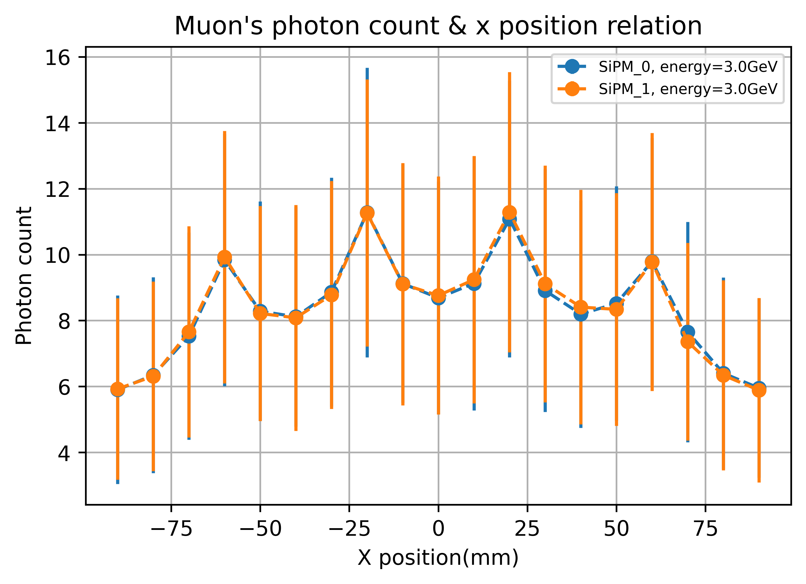

# MuonVeto: Geant4-based MC project for Muon Veto design


## Introduction ## 

`MuonVeto` is used in the RELICS experiment for detection of muons. Since muon-induced neutrons are the primary source of background, a compact muon veto is needed to detect muons coming inside the detector. 

In the current setup, the muon veto consists of **plastic scintillators**, **wavelength-shifting fibers** and **SiPMs**. When a muon deposits energy in the plastic scintillator, scintillation photons enter the fibers leading to the SiPMs. If the signal reaches a threshold, the detector determines that there is an incoming muon.

The specific geometry setup of the fibers are undetermined, and should be optimized. This project aims to optimize the design of the muon veto using Monte Carlo methods based on **geant4**. The geometry setup used currently is shown in the figure below.


## Dependencies

**geant4** version >= 11.0 (with support for OpenGL), **CMake** version >=3.16

Also, the analysis of the data needs **python** support. Python packages **jupyter notebook**, **numpy**, **matplotlib** are required.


## Usage

Source the `geant4.sh` and `geant4make.sh`  in the geant4 installation directory, and then run the following code in the terminal:

```shell
mkdir build/
cd build/
cmake ../
make
./MuonVeto # or ./MuonVeto ${some macro file} for batch mode
```

The code can work both in interactive mode and batch mode.

It is also possible to use `Makefile` to build the project with a single command. Just run:

```shell
make build
```

or use `make macro` to generate the macro files, use `make data` to acquire all the data. If `make` is run, it is equivalent to `make data`.

Currently in this project, the following relationships are explored: (for muons) photon counts & z/x position; (for gammas) photon counts & z position/energy.

`./analysis/analysis.ipynb` is a jupyter notebook used for drawing figures.




